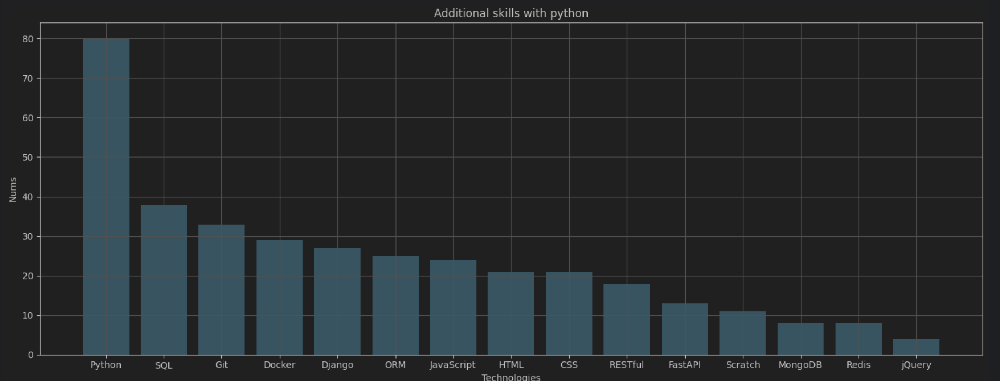

# Scraping-Analysis

This project scrapes job listings from a specified website and analyzes the data to extract valuable insights for Python developer job skills. The primary goal is to identify the most in-demand skills and trends in the job market for Python developers.

### Example:

## Features

- **Web Scraping**: Uses Scrapy to scrape job listings from a specified website.
- **Data Analysis**: Analyzes the scraped data to identify the most sought-after skills for Python developers.
- **Customizable**: Allows users to specify the skills they want to track via a `.env` file.

## Requirements

- Python 3.x
- Scrapy
- Pandas
- Jupyter Notebook

## Getting Started

Follow these instructions to set up and run the project on your local machine.

### 1. Add .env File

Create a `.env` file in the root directory of the project and specify the skills you want to track. The file should look like this:

```plaintext
TECHNOLOGIES=Python,Django,Flask
```

### 2. Install Requirements

Install the required Python packages using the `requirements.txt` file. Run the following command in your terminal:

```sh
pip install -r requirements.txt
```

### 3. Run the Scraper

Open your terminal and navigate to the `jobs_python` folder. Run the following command to start the scraping process:

```sh
scrapy crawl jobs -o jobs.csv
```

This will scrape the job listings and save the data to a `jobs.csv` file.

### 4. Perform Data Analysis

Open the `dataAnalytic.ipynb` Jupyter notebook to analyze the scraped data. You can start the Jupyter notebook server and open the notebook with the following commands:

```sh
jupyter notebook
```

Navigate to the `dataAnalytic.ipynb` file and run all cells to perform the data analysis.

## Project Structure

```
Scraping-Analysis/
├── jobs_python/
│   ├── __init__.py
│   ├── items.py
│   ├── middlewares.py
│   ├── pipelines.py
│   ├── settings.py
│   └── spiders/
│       └── jobs_spider.py
├── dataAnalytic.ipynb
├── .env
├── requirements.txt
└── README.md
```

## Contributing

Contributions are welcome! Please feel free to submit a Pull Request.


Feel free to modify the content as needed to better fit your project's specifics.


